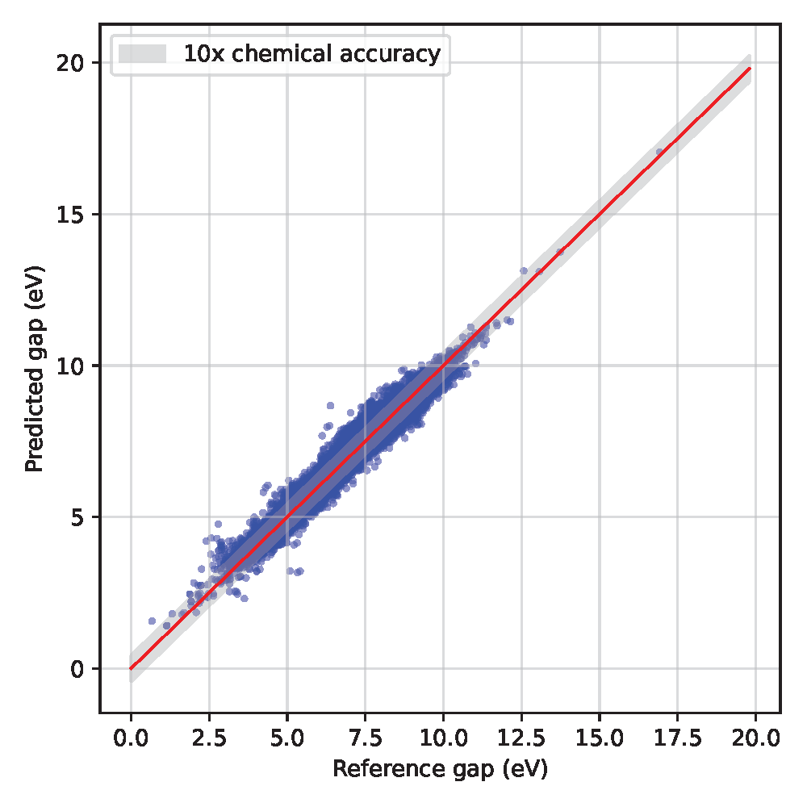
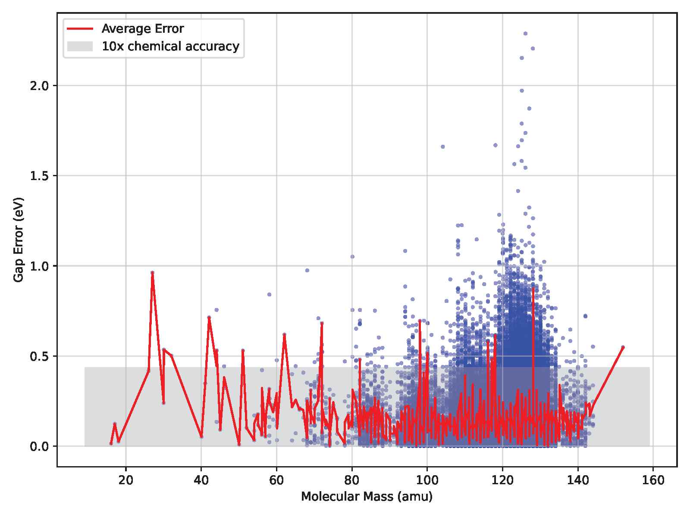
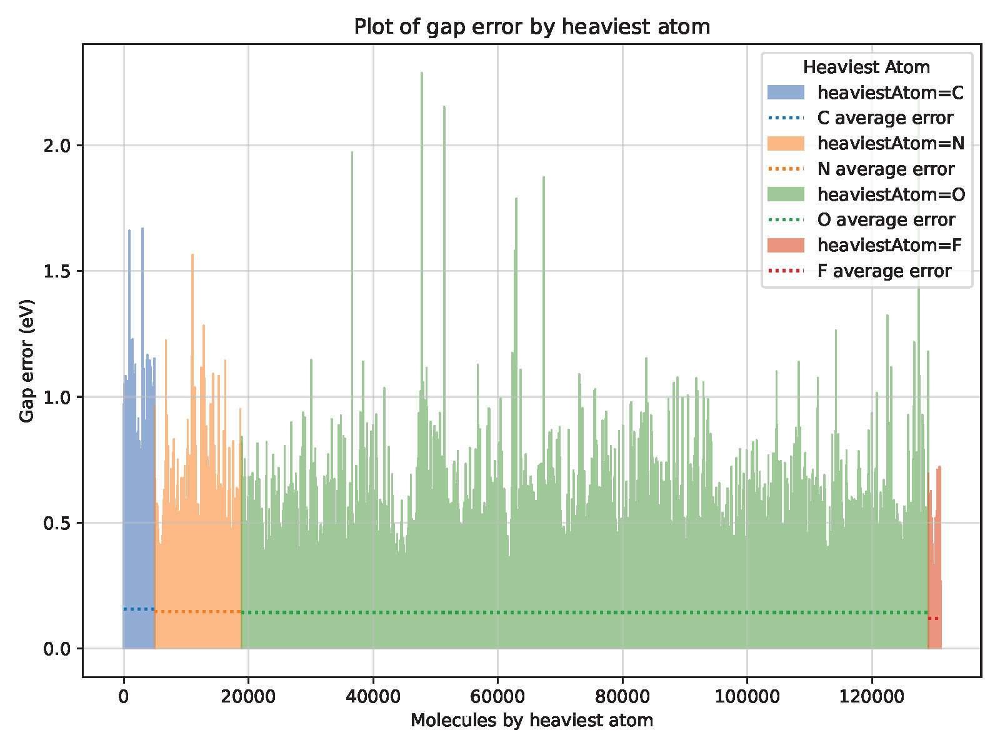

# Graph Neural Network for Modeling Molecular Properties

**Author:** Tommy Lin

## Summary

This project implements state-of-the-art GNN models for accurately predicting 
chemical properties.

## Table of contents

1. [Code Usage](#codeUsage)
2. [Introduction](#introduction)
3. [GNN Models](#gnnModels)
4. [Dataset](#dataset)
5. [Hyperparameter Tuning](#hyperTuning)
6. [Results and Analysis](#results)

##  Code Usage

Installation of required packages (using `pip`):

    pip install -r requirements.txt

After satisfying all the package installation requirements, users can run the code using 

    python main.py [configFilename]

The calculation settings is passed via command line in a YAML file. 

Each configuration file specifies settings for `Job` and for `Model`. There are three available job types as specified in `run_mode`: `Training`, `Hyperparameter`, and `Inference`. Please see the sample config_xxx.yml files in the root directory for reference. 

Users can also specify whether to load an existing model (from PyTorch .pth files) for further tuning or start from scratch. 

One can also choose to fit to HOMO-LUMO gap or the dipole moment (as well as other molecular properties in the QM9 dataset). 

In the `Model` section, one can specify almost all details of the GNN models, from number of neurons in each structure, to learning rate, batch size and optimizer. Note that for the hyperparameter tuning mode, any model setting passed in as a list will be tuned. For the inference mode, care must be taken that the model setting in the config file is the same as the model saved in the .pth file. 

##  Introduction

Machine learning (ML) models have been shown to have great predictive potentials 
in the chemical space. The data structure of molecules and the rotational invariance 
require more general machine learning models. Graph neural networks (GNN), with its 
general data structure and message-passing formalism, suited this need.

In this project, I implement state-of-the-art GNN models in the context of 
molecular property predictions. The GNN models are trained on 
the molecular properties of 130k+ small organic molecules. The hyperparameters of 
the models are tuned. The GNN models show great performance that reach well 
beyond the chemical accuracy.

<figure>
    
    <figcaption>Fig 1. The prediction of the HOMO-LUMO gap across the QM9 dataset with the tuned SchNet model. The diagonal shaded grey area is 10 times of the chemical accuracy (10 kcal/mol). </figcaption>
</figure>

##  GNN Models

Chemistry and materials science applications call for specialized MPNN models that 
handle unevenly spaced data and update edge, node, and global attributes better than general Message Passing Neural Networks (MPNNs). Thus, in this project, I implement two GNN models.

The first one uniquely uses continuous-filter convolutional layers, as opposed to 
the discrete convolutions typically found in GCNs. This enables it to capture local 
correlations in unevenly spaced data, i.e., atomic positions in molecules. This is 
inspired by the [SchNet model](
https://doi.org/10.48550/arXiv.1706.08566). 

The second model uses a convolutional 
operator to update graph attributes instead of simple linear operations in standard 
GCNs. It also uses a pooling layer to aggregate node information to predict molecular 
properties. This model is similar to the [Materials Graph Network (MEGNet)](https://doi.org/10.1021/acs.chemmater.9b01294). Both models take into account quantum chemistry 
constraints like rotational equivariance.

<figure>
    
    <figcaption>Fig 2. HOMO-LUMO gap energy prediction, for molecules sorted by molecular mass. The shaded grey area is 10 times of the chemical accuracy (10 kcal/mol). </figcaption>
</figure>

Note that there are many other GNN models with high performance in the literature. 
[OrbNet](https://doi.org/10.1063/5.0021955), 
[Crystal Graph Convolutional Neural Network 
(CGCNN)](https://doi.org/10.1103/PhysRevLett.120.145301), 
[Atomistic Line Graph Neural Network (ALIGNN)](https://doi.org/10.1038/s41524-021-00650-1), 
Gated Graph Neural Networks (GG-NN), and Deep Tensor Neural Networks are some 
models in the literature with great performance in the chemical and materials domain.

##  Dataset

The [QM9 dataset](https://doi.org/10.1038/sdata.2014.22) is used for this project. 
QM9 contains a comprehensive collection of data on 134,000 small organic molecules. These molecules were calculated at the 
B3LYP/6-31G(2df,p) level of DFT. For this project, I also extracted two crucial chemical properties among the 19 given in QM9: the HOMO-LUMO gap energies and dipole moments. Both properties are important factors for a molecule's reactivity and interaction with biological targets. 

To facilitate machine learning applications, I  conducted rigorous data cleaning 
and extraction. The molecular representations in SMILES format were converted into graph 
data structures that are compatible with the GNN model coded in PyTorch Geometric. Atoms 
are denoted as nodes and bonds as edges. Node features and edge attributes were 
systematically extracted from the intrinsic chemical properties of the atoms and bonds. 
Edge weights were initialized to uniform due to the absence of a priori information. 
This preprocessing was executed using the RDKit package. The dataset was partitioned into 
training, validation, and test sets in an 80-10-10 ratio. 

<figure>
    
    <figcaption>Fig 3. The error of HOMO-LUMO gap predictions from the SchNet model, as grouped by chemical functional groups (color coded) within the QM9 dataset. The average gap error for each chemical groups is plotted as the dotted lines. </figcaption>
</figure>

##  Hyperparameter Tuning

Hyperparameter tuning is crucial for optimizing the performance of machine learning 
models. In this project, I use the efficient and effective hyperparameter optimization 
process of Async Successive Halving via RayTune, which has similar performance to 
HyperBand.

The hyperparameter search space is defined over all available parameters (including 
pre-GNN MLP depth, GNN depth, post-GNN MLP depth, cutoff distance, learning rates, batch 
sizes, etc.) and is widely customizable by users. 

The optimal hyperparameters for each GNN model (SchNet and MEGNET) with HOMO-LUMO gap as 
the training target were set as defaults in the code. 

<figure>
    
    <figcaption>Fig 4. The error of HOMO-LUMO gap predictions from the SchNet model, as grouped by the heaviest atom in the molecule within the QM9 dataset. The average gap error for atoms with the heaviest atom is plotted as the dotted lines. </figcaption>
</figure>

##  Results and Analysis

As an example, I show the performance and analysis for the GNN model for HOMO-LUMO gap prediction. 

As shown in Figures 1-4, we see a nearly uniform performance across large-gap and small-gap molecules, while some of the small-gap molecules have larger errors. Performance is fairly similar across molecules with C,N,O,F as the heaviest atom, as well as for molecules with different organic functional groups. Overall, the model gives decent performance that reproduces the DFT-computed gap energy within chemical accuracy. 
